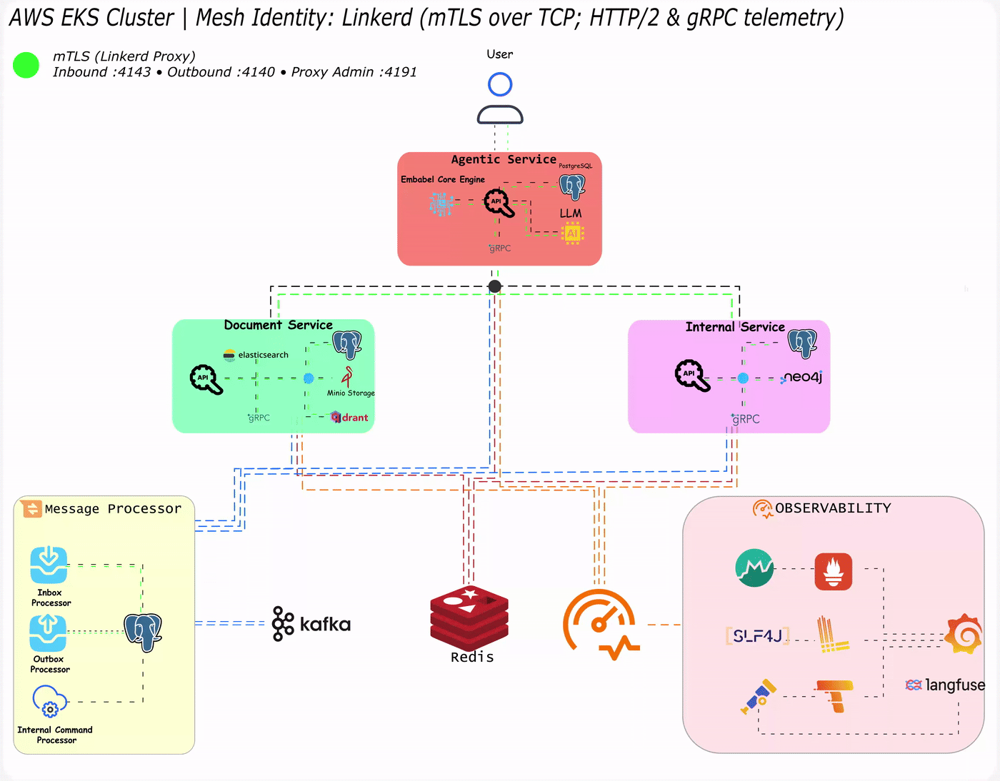

  

<h1 align="center">Sparrow-X</h1>

<h3 align="center">
  <em> Agent-Powered Company Intelligence.</em>
</h3>

🔁 Runtime Traffic Flow

*Animated service-to-service data flow inside the Sparrowx mesh.*

SparrowX is an internal knowledge and agentic search system for engineering organizations.
It connects company documents, service ownership, onboarding workflows, runbooks,
repositories and internal domain data into one searchable, explainable assistant.

## Core Services

SparrowX is built around three core services:

* **agenticsvc** - The orchestration layer that receives user missions, parses intent, plans tool calls, invokes internal services, coordinates agent execution, and produces grounded answers.

* **intsvc** - The structured internal system that stores teams, engineers, services, tasks, ownership, service metadata, and internal business/domain entities.

* **docsvc** - The document intelligence layer that handles document upload, extraction, chunking, hybrid retrieval, vector search, keyword search, citation verification, and evidence graph construction.

* **bb** - The shared building-blocks foundation. It provides reusable infrastructure used
  across SparrowX services, including command/query handling, validation, observability,
  tracing, metrics, exception handling, context propagation, resilience patterns, and
  common domain primitives. Non-executable library that keeps `agenticsvc`, `intsvc`, and `docsvc` consistent.

## What SparrowX Can Do

### 1. Internal Security Investigation

**Example multi-hop query:**

> “An incident report describes suspected credential exposure involving the
> Agentic Orchestrator service. Identify the responsible team, find the applicable
> credential-handling policies and incident-response runbooks, and outline the
> investigation and remediation steps supported by those documents.”

**Expected SparrowX execution:**

* **`intsvc`** resolves the affected service, owning team, responsible engineers, and available service relationships.
* **`docsvc`** retrieves the incident report, credential-handling policies, relevant service documentation, and incident-response runbooks.
* **`agenticsvc`** correlates the reported incident with service context and security guidance, identifies responsible owners, and produces a cited investigation plan that distinguishes documented facts from questions requiring verification.

### 2. Internal Knowledge Discovery

**Example multi-hop query:**

> “For the Agentic Orchestrator service, identify the owning team and primary
> engineers, find its architecture documents and deployment procedures, and
> locate the runbooks relevant to increased latency during agent execution.”

**Expected SparrowX execution:**

* **`intsvc`** resolves the service, owning team, associated engineers, and service metadata.
* **`docsvc`** retrieves relevant architecture documents, deployment procedures, and operational runbooks.
* **`agenticsvc`** connects ownership and document evidence into a cited answer explaining who is responsible, how the service operates, and which guidance applies.

### 3. Operational Risk & Process Analysis

**Example multi-hop query:**

> “Assess the Agentic Orchestrator service’s readiness for production deployments.
> Compare its documented procedures with company deployment standards, examine
> incident reports for recurring model timeouts, and identify gaps in rollback
> guidance, operational ownership, and runbook coverage.”

**Expected SparrowX execution:**

* **`intsvc`** gathers service metadata, ownership, team assignments, and available dependency information.
* **`docsvc`** retrieves company deployment standards, service procedures, architecture documents, incident reports, and runbooks.
* **`agenticsvc`** compares documented practices against requirements, identifies recurring issues and evidence gaps, and produces a cited risk assessment with recommended follow-up actions and responsible owners.

---

## 📊 Enterprise Simulation & LLMOps (Langfuse Integration)

Out of the box, SparrowX comes preloaded with a **production-grade seed data pipeline** designed to mimic a real, operating enterprise. The environment spins up a native **Agentic Service Team** alongside several other engineering teams acting as isolated organizational tenants.

This multi-tenant simulation generates active synthetic workloads, allowing you to view and analyze live LLMOps metrics via a built-in **Langfuse** dashboard. For organizations running autonomous agents at scale, this integration demonstrates how Langfuse enables you to:

* **Visualize Nested Agent Traces:** Inspect complex, multi-turn agent reasoning paths. You can track exactly how a parent orchestration span branches into specific document lookups, tool calls, or downstream LLM generations.
* **Monitor Multi-Tenant Cost & Latency:** Break down token consumption, financial costs, and latency profiles dynamically across different engineering teams, service domains, and model types.
* **Manage Prompts & Iteration Loops:** View how system prompts are centrally versioned, tested in the LLM playground, and hot-deployed to specific agent pipelines without code changes.
* **Track Operational Quality (Evals):** Monitor live performance using automated "LLM-as-a-judge" scoring metrics, capturing hallucination benchmarks and execution accuracy trends over time.
  This exposes Sparrowx as an agentic internal knowledge system that combines retrieval, structured company context, evidence verification, and workflow orchestration into one engineering assistant.

## Roadmap

| Feature          | Dormant | In Progress | Completed |
|------------------|---------|-------------|-----------|
| Agentic Service  |        |      ✅       |           |
| Building Blocks  |         |            |     ✅       |
| Document Service |        |             |       ✅    |
| Internal Service |        |             |      ✅     |

